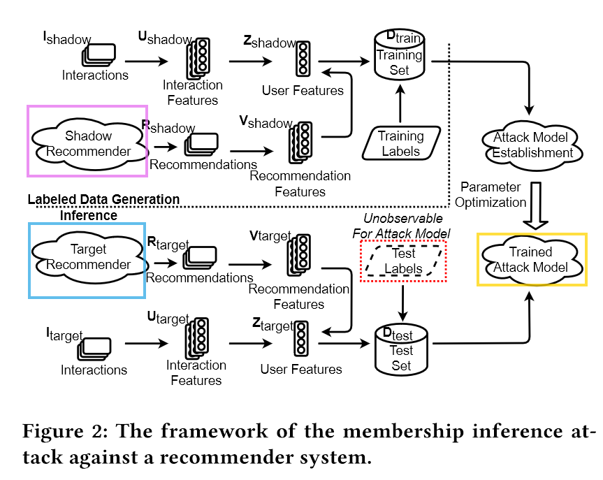
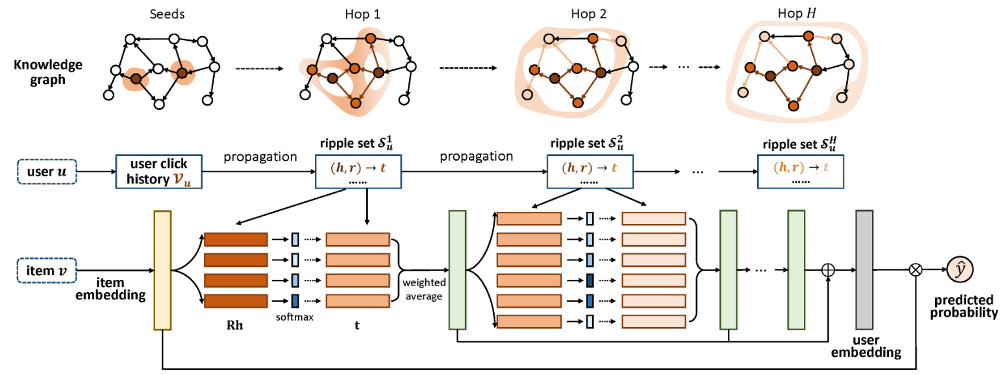

# Inference-attack-against-RS-based-on-KG

本项目主要采用文献1 [Membership Inference Attacks Against Recommender Systems](https://arxiv.org/abs/2109.08045)  的模型框架。

借鉴了文献2 [Debiasing Learning for Membership Inference Attacks Against Recommender Systems](https://arxiv.org/pdf/2206.12401.pdf) 的数据处理方式。

## 实验思路

我们在 movielens, amazon, book 数据集上对文献1结果进行复现，结果表明，在book这样的稀疏数据集上，MIA表现不佳。

MIA模型攻击准确性较低的原因主要有以下两点：

（1） 由于影子推荐器和目标推荐器之间的差距，攻击模型的训练数据存在偏差

（2） 推荐器中的隐藏状态不是观察性的，导致对差异向量的估计不准确

在稀疏数据集中，由于user与item交互记录较少，推荐模型无法基于user准确推荐，问题1所导致的低攻击准确度尤为明显。

因此我们提出一种针对问题1的可能的缓解方法：

首先创建了一个基于物品的知识图谱，并将用户与物品的互动直接链接到基于物品的知识图谱上。将知识图谱用在稀疏数据集上，有助于提高推荐模型对项目特征的理解，提高模型推荐的准确性。

设置

实验组：

Target model 稀疏数据集 + kg

Shadow model 稀疏数据集 + kg

对照组1:

Target model 稀疏数据集 + kg

Shadow model 稀疏数据集

对照组2：

Target model 稀疏数据集

Shadow model 稀疏数据集

若实验组MIA结果准确度更高，即可体现：

**知识图谱有助于在稀疏数据集上减小影子推荐器和目标推荐器之间的差距，进而提高MIA的准确度。**

## 实验设置：

推荐模型选择：

RippleNet([arXiv](https://arxiv.org/abs/1803.03467))是一种基于知识图谱的推荐系统，它引入了偏好传播，自动传播用户的潜在偏好并探索他们在KG中的分层兴趣，克服了现有的基于嵌入和基于路径的KG感知推荐方法的局限性。

Caser（Context-Aware Self-attentive Sequential Recommendation）是一种用于推荐系统的深度学习模型，特别适用于顺序推荐任务，如电影、音乐或商品推荐。

| -         | 模型      | 数据集 |
| --------- | --------- | ------ |
| 实验组：  |           |        |
| Shadow    | RippleNet | BOOK   |
| Target    | RippleNet | BOOK   |
| 对照组1： |           |        |
| Shadow    | caser     | BOOK   |
| Target    | RippleNet | BOOK   |
| 对照组2： |           |        |
| Shadow    | caser     | BOOK   |
| Target    | caser     | BOOK   |

## 实验结果：

| Metrics       | Experiment Group | Control Group1 | Control Group2 |
| ------------- | ---------------- | -------------- | -------------- |
| TruePositive  | 732              | 519            | 521            |
| FalsePositive | 542              | 234            | 234            |
| TrueNegative  | 1449             | 1757           | 1757           |
| FalseNegative | 302              | 515            | 1470           |
| Accuracy      | 0.75099          | 0.72239        | 0.57207        |
| Precision     | 0.57457          | 0.68924        | 0.69007        |
| Recall        | 0.70793          | 0.50193        | 0.26168        |
| AUC           | 0.71785          | 0.69220        | 0.57207        |

## 总结

该实验初步验证了：在稀疏数据集上，加入知识图谱有助于提高MIA的攻击准确性。

